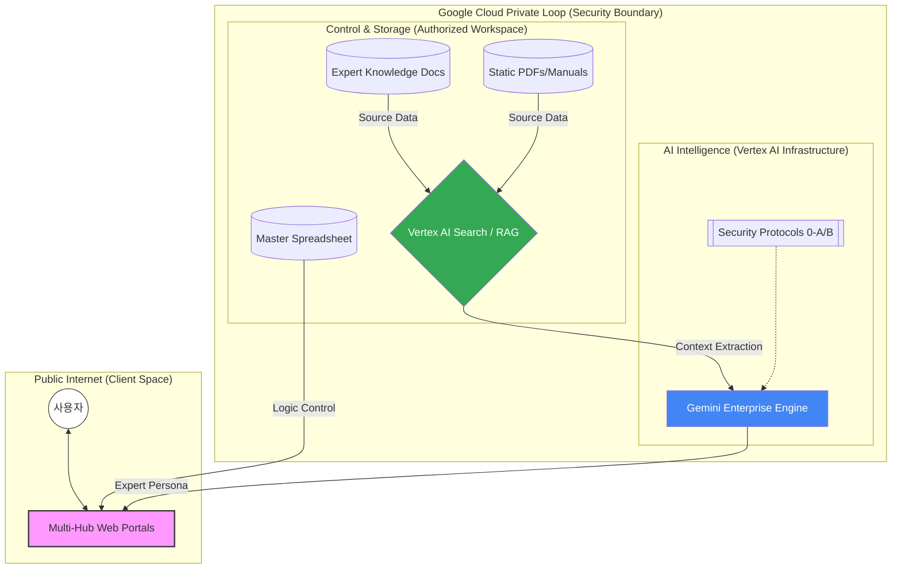

# Tax Hub 시스템 아키텍처 상세 분석 보고서

본 보고서는 'Tax Hub' 시스템의 구성을 **보안 기술(Private AI)**과 **지능형 인프라(Vertex AI)** 관점에서 재분석한 결과입니다.

---

## 0. 시스템 개요 (Private AI Lifecycle)
본 시스템은 구글의 엔터프라이즈 인프라를 기반으로, 데이터가 외부로 유출되지 않는 **'Private Loop'** 환경 내에서 작동하도록 설계되었습니다.

- **Unified Admin ID**: `g01023455460` (Google 관리자 식별자)를 통한 중앙 집중식 권한 관리.
- **Security Boundary**: Gemini Enterprise 라이선스를 통한 데이터 비학습(Zero Training) 보장.

## 1. 계층별 기술 스택 (Technical Stack)

### 🧩 1계층: 관리 및 제어 (Management Layer - Google Sheets)
- **역할**: 하드코딩 없이 시스템의 동작을 제어하는 **'Logic Controller'**이자 **'CMS'**입니다.
- **주요 데이터**: 서비스 목록, 허브별 노출 플래그(1/0), 관리자 식별 정보, 도구별 우선순위.

### 🧩 2계층: 데이터 및 지식 (Knowledge Layer - Google Drive/Docs)
- **역할**: AI의 전문성을 결정하는 **'Knowledge Engine'**입니다.
- **정적 지식**: 국세청 실무해설서, 판례 등 대용량 전문 자료 (Google Drive 보관).
- **동적 지식**: 전문가 그룹이 상시 수정·보완하는 실무 가이드 (Google Docs 연동).

### 🧩 3계층: 처리 및 지능 (Intelligence Layer - Vertex AI & Gemini)
- **Vertex AI (Search/RAG)**: 대량의 정적 지식을 '벡터화'하여 질문에 맞는 내용만 초고속으로 추출합니다.
- **Gemini Enterprise**: 추출된 지식을 바탕으로 전문가의 페르소나를 입혀 최종 답변을 생성합니다.
- **Private Compute**: 모든 연산은 구글의 격리구역(Enclave) 내에서 수행되어 데이터 유출을 원천 차단합니다.

### 🧩 4계층: 사용자 서비스 (Service Layer - Multi-Hub Portals)
- **Vercel 호스팅**: Centric, TaxAI, TaxForensics 등 전용 도메인으로 배포된 웹 프론트엔드.
- **API 연동**: Google Workspace API와 Vertex AI API를 안전하게 호출하여 실시간 데이터를 사용자에게 전달합니다.

---

## 2. 시스템 구성도 (System Diagram)

---

## 3. 핵심 아키텍처 특징 (Key Principles)

### 🛡️ 완벽한 데이터 격리 (Data Isolation)
- 데이터가 구글의 사설망(Private Network) 밖으로 나가지 않으며, 외부 DB 서버를 거치지 않고 소스(Docs)에서 엔진(Vertex)으로 직접 연결됩니다.

### ⚡ 실시간 지식 동기화 (Just-in-Time Knowledge)
- 전문가가 구글 문서를 수정하는 즉시 Vertex AI가 이를 인식하여 모든 에이전트의 지식이 실시간으로 업데이트됩니다.

### 📋 엄격한 실행 프로토콜
- **프로토콜 0-BETA**: 실시간 데이터 강제 조회를 통한 가설 배제.
- **프로토콜 0-ALPHA**: 오류 발견 시 즉각적인 캐시 파기(Purge) 및 영구 무효화 로직 작동.

---
*최종 업데이트: 2026-02-12*