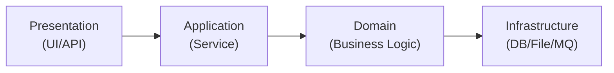
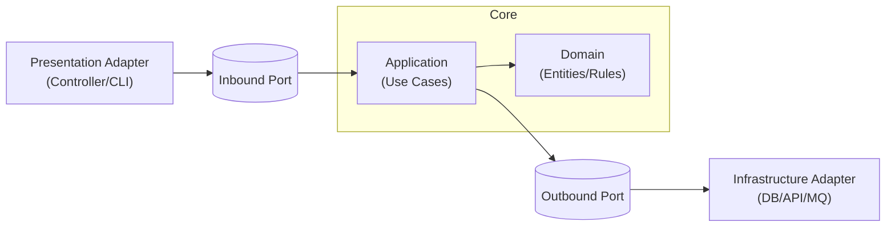
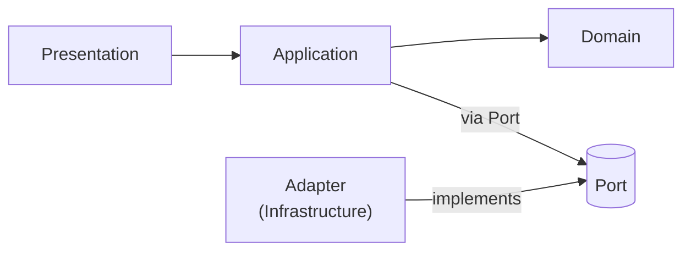

노션/깃허브/마크다운에 그대로 붙여 넣으면 그림이 렌더링돼.

---

### 1) 전통적인 계층형 구조 (Layered)

* 화살표는 **아래 계층으로만** 흐름.
* Domain이 Infra에  **직접 의존** (결합)할 수 있음.

---

### 2) 헥사고날 구조 (Hexagonal / Ports & Adapters)

* **도메인 중심** . 외부 세계는 **Port(추상)**를 통해서만 연결.
* **Adapter** (UI/Infra)가 Port를 **구현**하고, 모든 의존성은 **Core(안쪽)**을 향함.
* Domain은 Port/Adapter를 **모르며 순수**하게 유지.

---

### 3) 하이브리드 (계층형 + 포트-어댑터)

* **레이어드 흐름(UI → Application → Domain)**은 그대로 유지.
* 단, **Infra 접근만 Port/Adapter로 추상화**해 의존성을 역전.
* 실무에서 가장 많이 쓰이는  **실용적 절충안** .

---

#### 사용 팁

* 노션/깃허브에 붙일 때 코드블록 언어를 `mermaid`로 지정.
* 발표 슬라이드엔 3개 모두 넣고, **차이 포인트**는

  " **Port 적용 범위** (전부 vs Infra만)"와 " **의존성 방향** (도메인 안쪽)"을 강조하면 이해가 빨라져.

