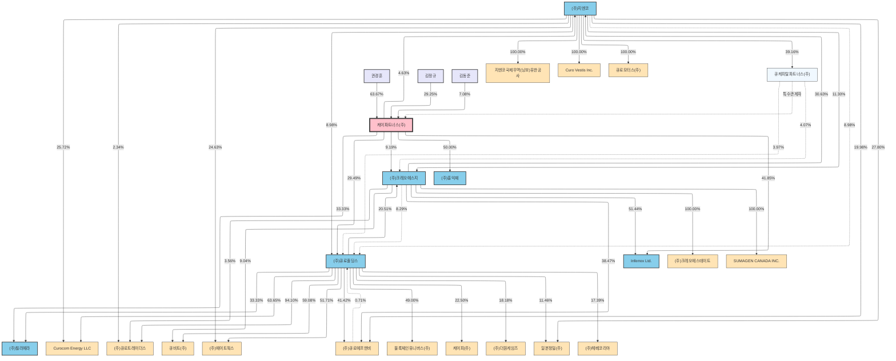

# 케이파트너스 기업집단 지배구조

## 📊 기업구조 다이어그램

```mermaid
---
config:
  layout: elk
  theme: default
---
flowchart TD
    %% 주주 구조
    A["권경훈"] -->|63.67%| KP["케이파트너스(주)"]
    B["김정규"] -->|29.25%| KP
    C["김동준"] -->|7.08%| KP
    
    %% 1차 계열사
    KP -->|29.49%| KR["(주)큐로홀딩스"]
    KP -->|9.19%| CREO["(주)크레오에스지"]
    KP -->|4.63%| GN["(주)지엔코"]
    KP -->|41.85%| IF["Inferrex Ltd."]
    KP -->|33.33%| PL["(주)필리에라"]
    KP -->|50.00%| YJ["(주)홍익재"]
    
    %% 2차 계열사 (큐로홀딩스 산하)
    KR -->|20.51%| CREO
    KR -->|63.65%| CE["Curocom Energy LLC"]
    KR -->|94.10%| KT["(주)큐로트레이더스"]
    KR -->|59.08%| QB["큐비트(주)"]
    KR -->|51.71%| EW["(주)에이트웍스"]
    KR -->|41.42%| KFNB["(주)큐로에프앤비"]
    KR -->|33.33%| PL
    KR -->|49.00%| BU["블록체인유니버스(주)"]
    KR -->|22.50%| KP2["케이피(주)"]
    KR -->|18.18%| ONE["(주)더원게임즈"]
    KR -->|11.46%| JP["일본정밀(주)"]
    KR -->|17.39%| HK["(주)헤베코리아"]
    
    %% 2차 계열사 (크레오에스지 산하)
    CREO -->|100.00%| CEST["(주)크레오에스테이트"]
    CREO -->|100.00%| SUM["SUMAGEN CANADA INC."]
    CREO -->|51.44%| IF
    CREO -->|30.63%| GN
    CREO -->|38.47%| KFNB
    CREO -->|9.04%| QB
    CREO -->|3.56%| KT
    
    %% 2차 계열사 (지엔코 산하)
    GN -->|100.00%| GNT["지엔코국제무역(닝보)유한공사"]
    GN -->|100.00%| CV["Curo Vestis Inc."]
    GN -->|100.00%| QM["큐로모터스(주)"]
    GN -->|39.16%| QCP["큐캐피탈파트너스(주)"]
    GN -->|8.98%| KR
    GN -->|11.30%| CREO
    GN -->|27.80%| JP
    GN -->|25.72%| CE
    GN -->|19.98%| KFNB
    GN -->|24.63%| EW
    GN -->|2.34%| KT
    
    %% 교차투자 구조 (점선)
    CREO -.->|8.29%| KR
    GN -.->|8.98%| KR
    QCP -.->|3.97%| KR
    QCP -.->|4.07%| CREO
    KFNB -.->|0.71%| KR
    
    %% 큐캐피탈파트너스 관계
    QCP -.->|특수관계자| KP
    
    %% 스타일 정의
    classDef shareholder fill:#e6e6fa,stroke:#333,stroke-width:2px
    classDef parent fill:#ffc0cb,stroke:#333,stroke-width:4px
    classDef subsidiary fill:#87ceeb,stroke:#333,stroke-width:2px
    classDef tier3 fill:#ffe4b5,stroke:#333,stroke-width:1px
    classDef tier4 fill:#f0f8ff,stroke:#333,stroke-width:1px
    
    %% 스타일 적용
    class A,B,C shareholder
    class KP parent
    class KR,CREO,GN,IF,PL,YJ subsidiary
    class CE,KT,QB,EW,KFNB,BU,KP2,ONE,JP,HK,CEST,SUM,GNT,CV,QM tier3
    class QCP tier4
```

