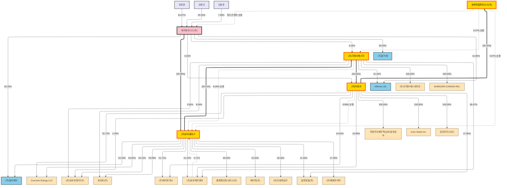

# 케이파트너스 기업집단 지배구조 (CSV 기반)

아래 다이어그램은 케이파트너스와 계열사의 지배·출자 관계를 한눈에 볼 수 있도록 정리한 자료입니다. **점선 화살표에 "순환" 표시가 있는 것은 순환 구조(상호 출자)**를, 일반 점선 화살표는 교차투자(지분 일부 보유)를 의미합니다.

## 📝 요약
- **핵심 축**: 케이파트너스(주) → 큐로홀딩스(29.49%) → 크레오에스지(20.51%) → 지엔코(30.63%) → 큐캐피탈파트너스(39.16%)
- **순환 구조**: 큐로홀딩스 ↔ 크레오에스지 ↔ 지엔코 ↔ 큐캐피탈파트너스 간 상호 출자로 순환적 지배구조 형성
- 주요 주주: 권경훈 63.67%, 김정규 29.25%, 김동준 7.08% → 케이파트너스(주) 지분 보유
- 1차 계열(케이파트너스 직·간접 출자): 큐로홀딩스, 크레오에스지, 지엔코, Inferrex Ltd., 필리에라, 홍익재 등
- 큐로홀딩스 산하: 크레오에스지, Curocom Energy LLC, 큐로트레이더스, 큐비트, 에이트웍스, 큐로에프앤비, 필리에라, 블록체인유니버스, 케이피, 더원게임즈, 일본정밀, 헤베코리아 등
- 크레오에스지 산하: 크레오에스테이트, SUMAGEN CANADA INC, Inferrex Ltd., 지엔코, 큐로에프앤비, 큐로홀딩스, 큐비트, 큐로트레이더스 등
- 지엔코 산하: 지엔코국제무역(닝보), Curo Vestis Inc., 큐로모터스, 큐캐피탈파트너스 등
- 펀드(QCP) 관련 투자: 다수 펀드·투자조합에 분산 투자 및 GP 관계 존재

## 🗺️ 범례
- 색상: 주주(연보라), 모회사(핑크·두꺼운 테두리), **핵심 축(금색·두꺼운 주황 테두리)**, 1·2차 계열(하늘색), 3차(연주황), 4차(연하늘)
- 선 유형: **두꺼운 실선(==)=핵심 축**, 일반 실선=지배/출자, **점선 "순환"=순환 구조(상호 출자)**, 일반 점선=교차투자(소수 지분 등)
- **핵심 축**: 케이파트너스 → 큐로홀딩스 → 크레오에스지 → 지엔코 → 큐캐피탈파트너스
- **순환 구조**: 
  - 큐로홀딩스 ↔ 크레오에스지 (KR→CREO 20.51%, CREO→KR 8.29%)
  - 큐로홀딩스 ↔ 지엔코 (KR→GN 간접, GN→KR 8.98%)
  - 큐캐피탈파트너스 ↔ 큐로홀딩스 (GN→QCP 39.16%, QCP→KR 3.97%)
  - 큐캐피탈파트너스 ↔ 크레오에스지 (간접, QCP→CREO 4.07%)
  - 큐캐피탈파트너스 ↔ 케이파트너스 (핵심 축, QCP→KP 특수관계자)

# 케이파트너스 기업집단 지배구조

## 📊 기업구조 다이어그램

